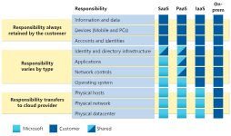

# [Describe Cloud Concepts - 3 parts in this module](https://learn.microsoft.com/en-us/training/paths/microsoft-azure-fundamentals-describe-cloud-concepts/)

## Describe cloud computing.
    - Introduction to Microsoft Azure Fundamentals 
        - Microsoft Azure is a cloud computing platform.
        - Azure has simple web services for hosting your business presence in the cloud.
        - Azure also supports running fully virtualized computers managing your custom software solutions.
        - Azure provides a wealth of cloud-based services like remote storage, database hosting, and centralized account management.
        - Azure also offers new capabilities like artificial intelligence (AI) and Internet of Things (IoT) focused services.

    - What is Azure Fundamentals?
        - Azure Fundamentals is a series of three learning paths that familiarize you with Azure and its many services and features.
        - Azure Fundamentals includes interactive exercises that give you hands-on experience with Azure. Many exercises provide a temporary Azure portal environment called the sandbox, which allows you to practice creating cloud resources for free at your own pace.

    - What is cloud computing?
        - Cloud computing is the delivery of computing services over the internet.
        - Computing services include common IT infrastructure such as virtual machines, storage, databases, and networking.
        - Cloud services also expand the traditional IT offerings to include things like Internet of Things (IoT), machine learning (ML), and artificial intelligence (AI).
        - Since cloud computing uses internet to deliver these services, it should not be constrained by physical infrastructure like a traditional datacenter is.
        - This means if you need to rapidly expand the IT infrastructure, we can use the cloud to rapidly do it.

    - Describe the shared responsibility model
        - [Ref](https://learn.microsoft.com/en-us/training/modules/describe-cloud-compute/4-describe-shared-responsibility-model)
        - For a traditional data center, company is responsible for maintaining the physical space, ensuring security, and maintaining or replacing the servers if anything happens. The IT department is responsible for maintaining all the infrastructure and software needed to keep the datacenter up and running.
        - With the shared responsibility model, these responsibilities get shared between the cloud provider and the consumer.
        - Physical security, power, cooling, and network connectivity are the responsibility of the cloud provider.
        - The consumer is responsible for the data and information stored in the cloud. 
        - The consumer is also responsible for access security, meaning you only give access to those who need it.
        - If you’re using a cloud SQL database, the cloud provider would be responsible for maintaining the actual database. However, you’re still responsible for the data that gets ingested into the database. 
        - If you deployed a virtual machine and installed an SQL database on it, you’d be responsible for database patches and updates, as well as maintaining the data and information stored in the database.
        - With an on-premises datacenter, you’re responsible for everything. With cloud computing, those responsibilities shift.
        - The shared responsibility model is heavily tied into the cloud service types

            - Infrastructure as a service (IaaS) - IaaS places the most responsibility on the consumer, with the cloud provider being responsible for the basics of physical security, power, and connectivity.

            - Platform as a service (PaaS) - PaaS, being a middle ground between IaaS and SaaS, rests somewhere in the middle and evenly distributes responsibility between the cloud provider and the consumer

            - Software as a service (SaaS) - SaaS places most of the responsibility with the cloud provider.
        
            - 
            
            - You’ll always be responsible for:
                - The information and data stored in the cloud, Devices that are allowed to connect to your cloud (cell phones, computers, and so on), The accounts and identities of the people, services, and devices within your organization
            - The cloud provider is always responsible for:
                - The physical datacenter, The physical network, The physical hosts
            - Your service model will determine responsibility for things like:
                - Operating systems, Network controls, Applications, Identity and infrastructure
        
    ## Describe the benefits of using cloud services.
    ## Describe cloud service types.
